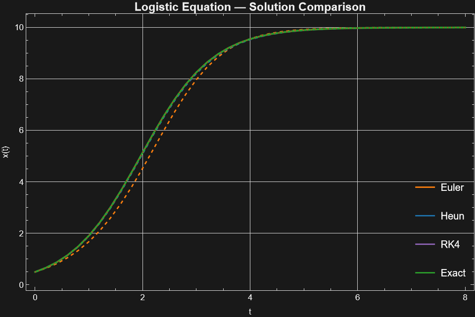
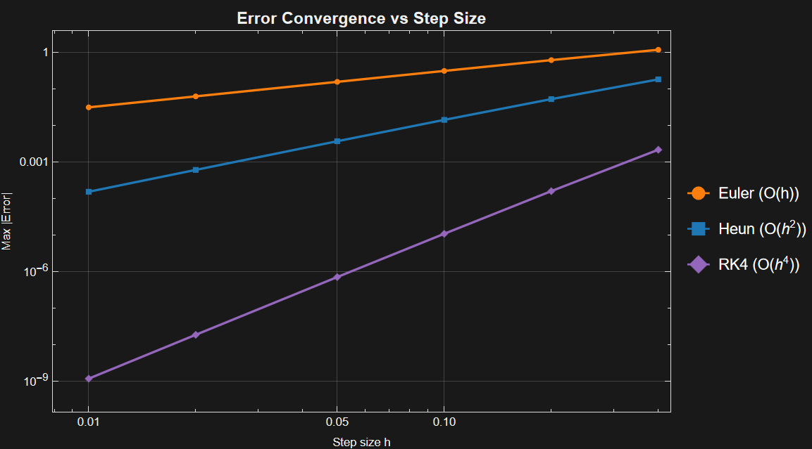
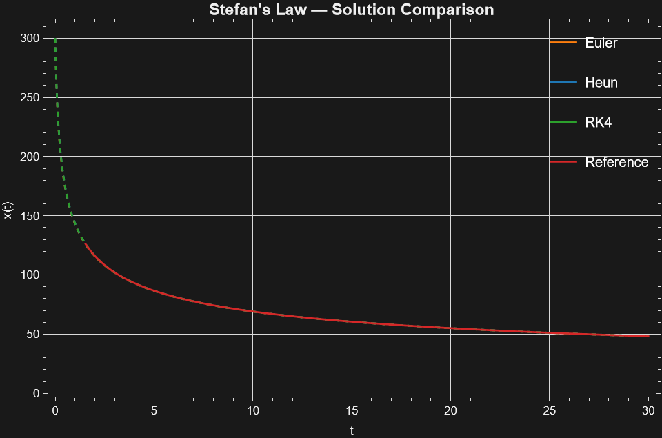
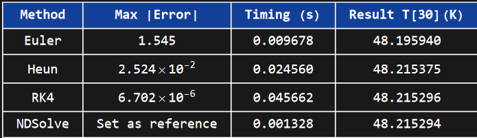
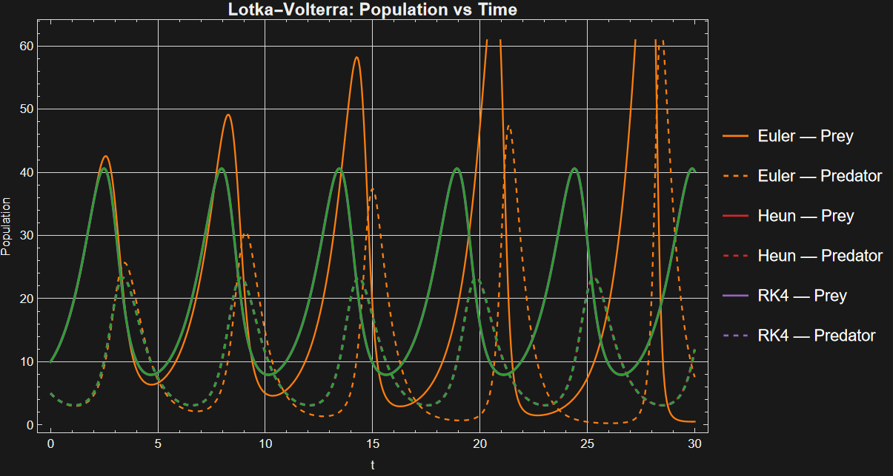
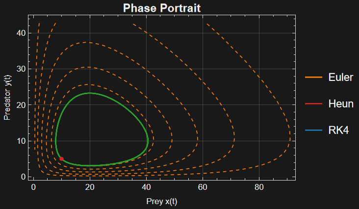
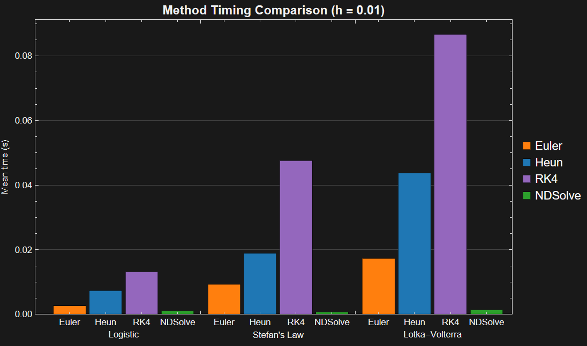
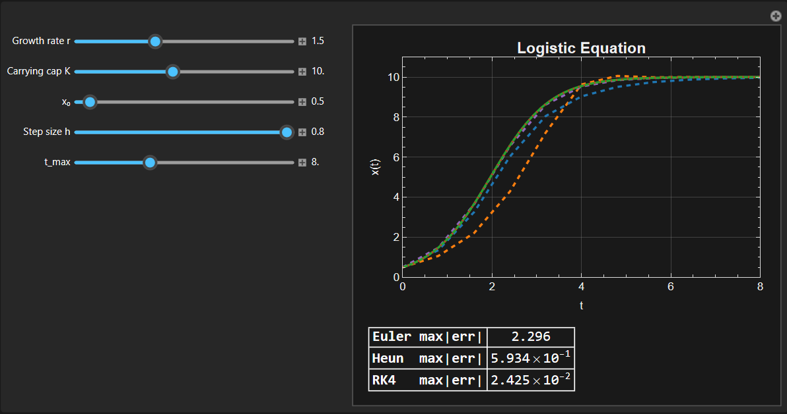
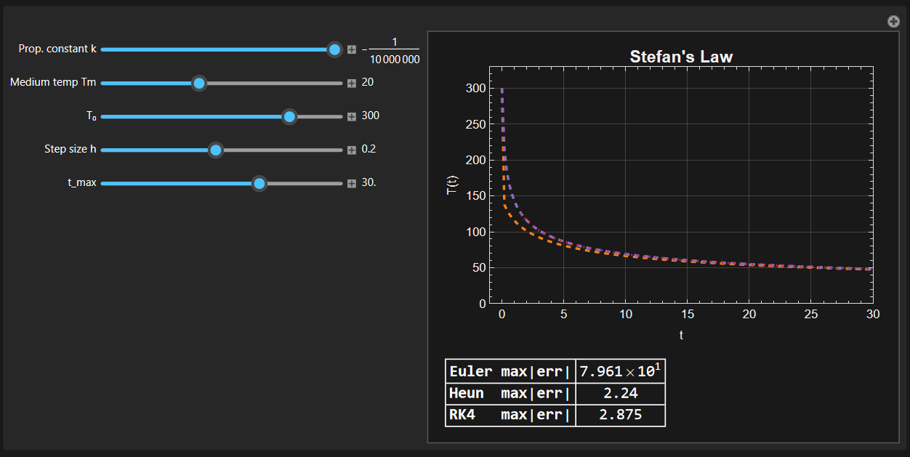

# Numerical Methods Benchmarking Suite
 

This folder contains a self-contained Mathematica project that implements, compares, and benchmarks classical ODE solvers against Wolfram's built-in `NDSolve` on three canonical problems.

---

## Repository structure

```
│
└── numerical-methods/
    ├── notebook.nb         # Main Mathematica notebook (all code + outputs)
    ├── src/
    │   └── methods.wl      # Reusable Wolfram Language package
    │
    ├── example-outputs/
    │   ├── Interactive-Logistic.png
    │   ├── Interactive-Stefan-Law.png
    │   ├── Logistic-function-comparison.png
    │   ├── Logistic-function-h-comparison.png
    │   ├── Lotka-Volterra-phase-space.png
    │   ├── Lotka-Volterra-system-comparison.png
    │   ├── Stefan-law-comparison.png
    │   ├── Stefan-law-error-table.png
    │   └── Timing-comparison-all.png
    │
    └── README.md           # Documentation for the numerical methods project
```

---

## Problems solved

| Problem | Equation | Exact solution? |
|---|---|---|
| **Logistic growth** | `dx/dt = r x (1 - x/K)` | ✅ Yes — benchmarked against it |
| **Stefan's Law** | `dT/dt = k(T^4-Tm^4)` | ❌ Benchmarked against NDSolve |
| **Lotka-Volterra** | `dx/dt = αx - βxy`, `dy/dt = δxy - γy` | ❌ Benchmarked against NDSolve |

---

## Methods implemented

### Euler (explicit, 1st-order)
```mathematica
eulerStep[f_, x_, t_, h_] := x + h * f[x, t]
```
Local truncation error $O(h^2)$ → global error $O(h)$.

### Heun (2nd-order)
```mathematica
heunStep[f_, x_, t_, h_] := x + (h/2) (f[x, t] + f[x + h*f[x, t], t + h/2 ])
```
Local truncation error $O(h^3)$ → global error O(h^2).

### Runge-Kutta 4 (RK4, 4th-order)
```mathematica
rk4Step[f_, x_, t_, h_] :=
  Module[{k1, k2, k3, k4},
    k1 = f[x,           t       ];
    k2 = f[x + h k1/2,  t + h/2 ];
    k3 = f[x + h k2/2,  t + h/2 ];
    k4 = f[x + h k3,    t + h   ];
    x + (h/6)(k1 + 2 k2 + 2 k3 + k4)
  ]
```
Local truncation error $O(h^5)$ → global error $O(h^4)$.

Both step functions are **scalar and vector compatible**, the same code handles both scalar (logistic) and vector (Lotka-Volterra) RHS functions.

### NDSolve (built-in reference)
Wolfram's adaptive solver used as the gold-standard reference for timing and accuracy comparisons.

---

## What the notebook covers

### Section 1: Manual implementations
Self-contained step functions and full trajectory integrators using `Reap`/`Sow` for efficient list building.

### Section 2: Logistic equation
- Solve with Euler, Heun, RK4, and NDSolve
- Compare against **closed-form exact solution**
- **Error table** (max |error|), **timing** (`AbsoluteTiming`) and final value.
- **Convergence plot**: log-log error vs step size `h` showing $O(h)$, $O(h^2)$ and $O(h^4)$ slopes

### Section 3: Stefan's Law
- Solve the Stefan's Law for radiation with all four methods
- Compare against **NDSolve solution**
- **Error table** (max |error|), **timing** (`AbsoluteTiming`) and final value.
- **Convergence plot**: log-log error vs step size `h` showing $O(h)$, $O(h^2)$ and $O(h^4)$ slopes

### Section 4: Lotka-Volterra system
- Solve the predator-prey system with all four methods
- **Time-series plot** (populations vs time)
- **Phase portrait** (predator vs prey, periodic orbits)
- Energy conservation check (Lyapunov function)

### Section 5: Performance benchmarking
- Each method timed over 5 runs, mean taken
- **Bar chart** comparing Euler / Heun / RK4 / NDSolve on the three problems

### Section 6: Interactive `Manipulate` dashboards
Three interactive panels with sliders for:
- **Logistic explorer**: `r`, `K`, `x₀`, step size `h`, `t_max`
- **Stefan's Law explorer**: `k`, `Tm`, `T₀`, step size `h`, `t_max`
- **Lotka-Volterra explorer**: all four parameters `α β δ γ`, initial
  conditions, `h`, `t_end`

Live error readout updates as you drag sliders.

---

## Key results (typical run, h = 0.1)

| Method | Logistic max\|error\| | LV max||error||₂ | Timing (Logistic) |
|---|---|---|---|
| Euler | ~$1.5\times 10^{-2}$ | ~0.8 | fast |
| RK4 | ~$1.75\times 10^{-4}$ | ~$10^{-2}$ | ~$1.5\times$ Euler |
| RK4 | ~$2\times 10^{-6}$ | ~$10^{-4}$ | ~$2\times$ Euler |
| NDSolve | ~$10^{-8}$ | (reference) | variable |

RK4 is **~4 orders of magnitude more accurate** than Euler for the same step size, with only ~2 times the computation cost per step.

### Time evolution of the systems

The logistic function numerical method comparison is:



And the error of each numerical method evolves as follows:



The Stefan's law numerical method comparison is:





The Lotka-Volterra system numerical method comparison is:





### Comparison of method timing

The mean computing time of each method over the three systems is as follows:



### Interactive plots

The last section of the `notebook.nb` has the following interactive dashboards:





---

## How to run

1. Open `notebook.nb` in Mathematica 12+ (or Wolfram Desktop).
2. Evaluate **all cells** (`Evaluation → Evaluate Notebook`).
3. Use the `Manipulate` dashboards in Sections 5.1 and 5.2 interactively.

To use only the package:
```mathematica
Get["path/to/src/methods.wl"]
sol = RK4Solve[LogisticRHS[1.5, 10.0], 0.5, {0, 8}, 0.1]
```

---

## Dependencies

- Mathematica 12.0+ (or Wolfram Engine 12.0+)
- No external packages required